# 🎲 BoardGame

The application is designed to **record and analyze board game sessions**.  

With this app you can: 
- **Create a player list** – each player has their total number of games played and wins stored. 
- **Create a board game list** – games can be added manually (basic data: name, number of players, type, expansion/base game) or automatically imported from the **BoardGameGeek (BGG)** database. 
- **Add gameplays** – each session contains information about the game played (base/expansions), participating players, the winner, the date of the session, and an optional description. 
- **Browse game history** – see a list of past sessions with the date, game name, participants, and the winner. 
- **Analyze statistics** – e.g., how many players participated in sessions, which games are played most often, how many wins each player has, and reports in chart form.  

The application works in two modes: 
- **Guest** – data is stored locally. 
- **Logged-in user** – data is synchronized with the **Firebase Database**, allowing saving and retrieving across devices. 
 
A demo account is available on request, or you can try the app right away in **Guest** mode.  

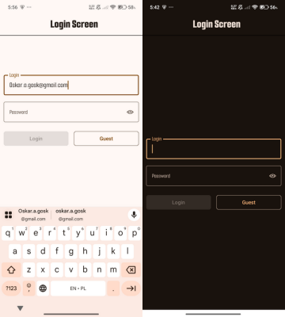 
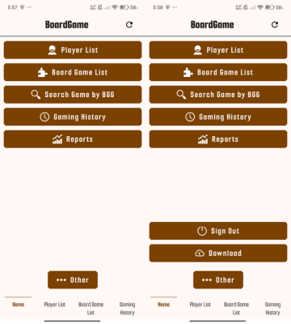 
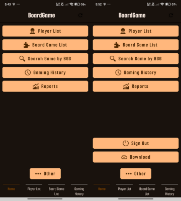 

  
## 👤 Player List 

Each player shows the total number of games played and wins. 
You can search for players by nickname and sort by name or number of games played.  

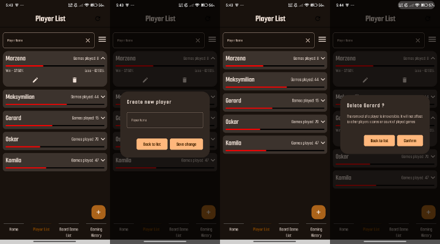 
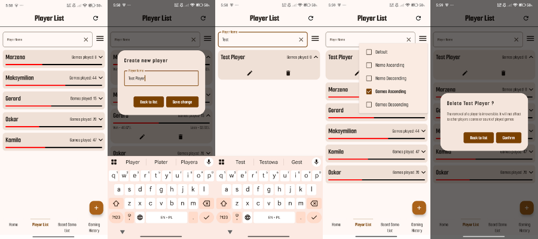 

  
## 🎲 Board Game List 

Shows basic information about each game, including min/max players and total sessions. 
Games can be added, edited, or deleted. 
Search and sorting options are available to filter results.  

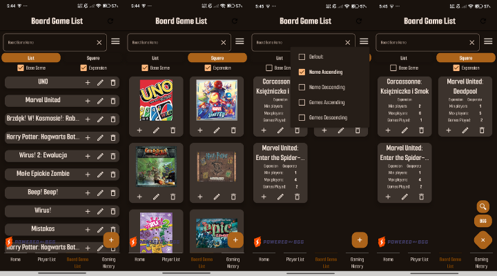 
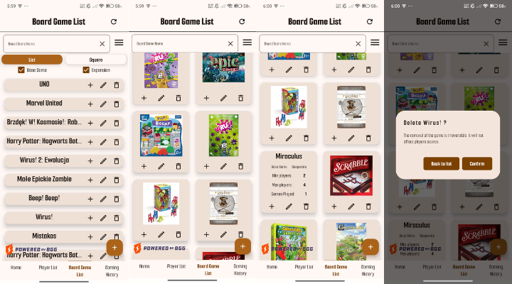 
  
Games can be added manually or imported from the **BGG database**.  

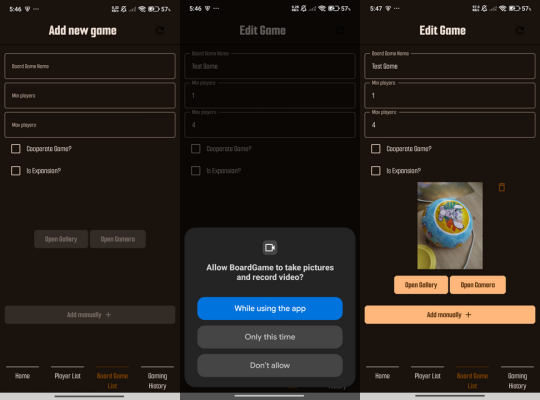 
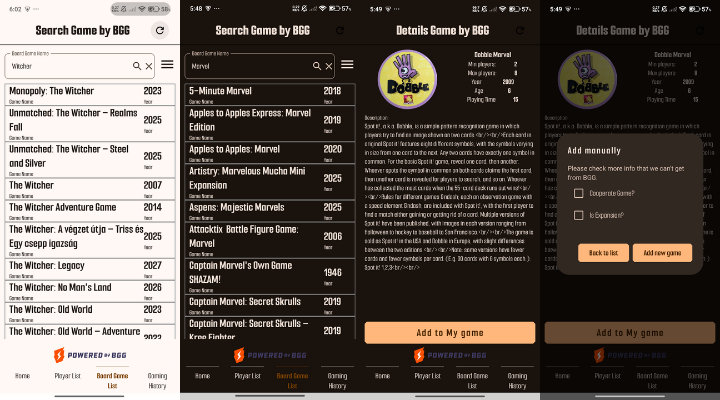 

  
## ➕ Add Gameplay 

Clicking "+" on the game list allows you to add a new gameplay session. 
Select if you played only the base game or with expansions. 
Choose participating players, date, winner, and optionally add a description of the session. 
You can switch the game mode between normal (Player vs Player) or Co-Op.  

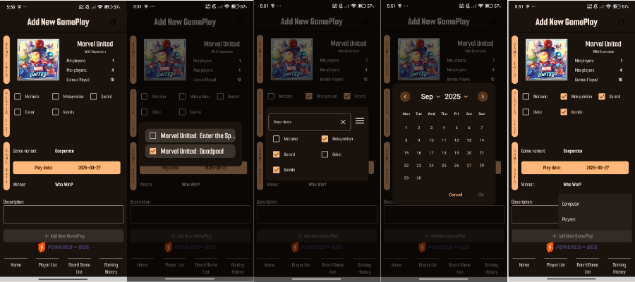 
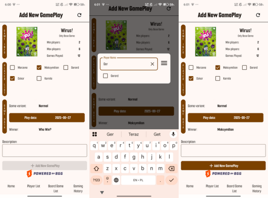 

## 📜 Game History 

View past game sessions, search by game or player name. 
Displays game name, date, players involved, and the winner.  

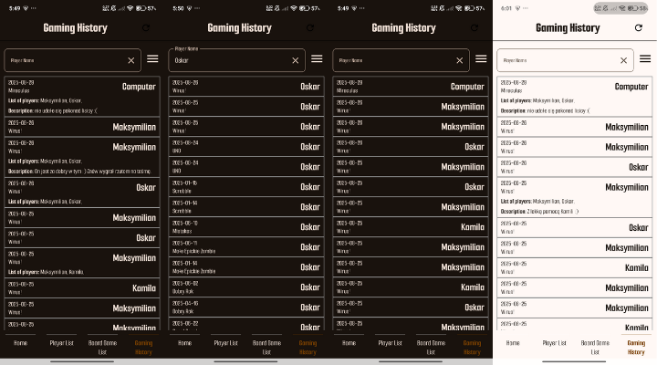 

  
## 📊 Reports 

Currently, one chart is available to show the number of gameplays based on selection. 
It can display sessions per year, month, or custom period. 

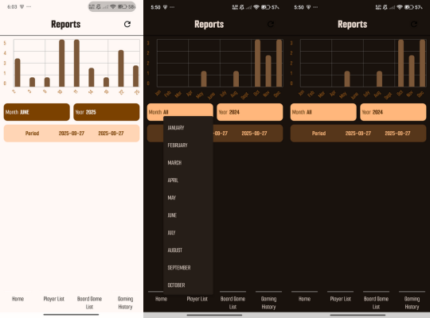 

   
📄 Licenses

This project's own source code is licensed under the [MIT License](LICENSE).

This project uses several open-source libraries. Key libraries and their licenses include:

[Voyager](https://github.com/adrielcafe/voyager) – MIT License

[Koin](https://insert-koin.io/) – Apache License 2.0

[Retrofit](https://square.github.io/retrofit/) – Apache License 2.0

[Gson](https://github.com/google/gson) – Apache License 2.0

[Coil](https://github.com/coil-kt/coil) – Apache License 2.0

[Timber](https://github.com/JakeWharton/timber) – Apache License 2.0

[Simple XML](http://simple.sourceforge.net/) – Apache License 2.0

[Compose Charts](https://github.com/ehsannarmani/ComposeCharts) – Apache License 2.0

[Sheets Compose Dialogs](https://github.com/maxkeppeler/sheets-compose-dialogs) – MIT License

[Firebase – Google Play Services Terms](https://firebase.google.com/)

You can find full license texts in the third_party_licenses.txt file.
