# 🎲 BoardGame Tracker

The application is designed to **record and analyze board game sessions**.  

With this app you can: 
- **Create a player list** – each player has their total number of games played, win rate and rank. 
- **Create a board game collection** – games can be added manually (name, number of players, category, year, co-op, cover photo) or imported from the **BoardGameGeek (BGG)** database. 
- **Log gameplay sessions** – game, date, duration, participating players, the winner and optional notes. 
- **Browse game history** – sessions grouped by time (this week / earlier) with search, plus a details screen for every session. 
- **Track your own stats** – pick "who you are" and see total games, most played game and win ratio on the home screen.  

The application works in two modes: 
- **Guest** – data is stored locally. 
- **Logged-in user** – data is synchronized with the **Firebase Database**, allowing saving and retrieving across devices. 
 
A demo account is available on request, or you can try the app right away in **Guest** mode.  

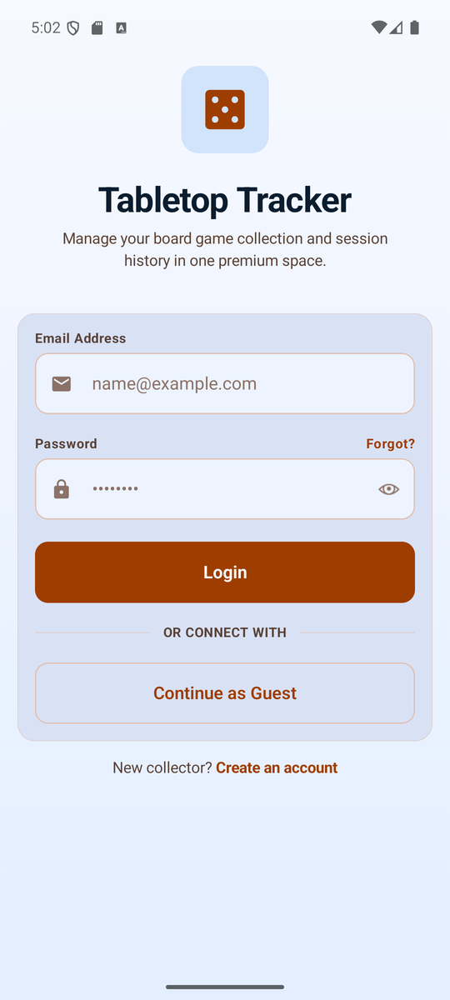

 

## ✨ New look (UI redesign)

> 🤖 **The new look of the app was designed and implemented in collaboration with AI** ([Claude Code](https://claude.com/claude-code)).
> The AI helped with the visual direction, the Compose components and the screen-by-screen refactor; all changes were reviewed, tested and shipped by the author.
> All screenshots below were taken from a real emulator running the current build (test account).

**Before → after.** The old app was a menu of text buttons that opened separate lists. The redesign turns it into a dashboard with bottom navigation:

| Before (`master`) | After |
|:---:|:---:|
| 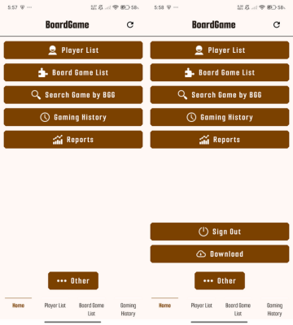 | 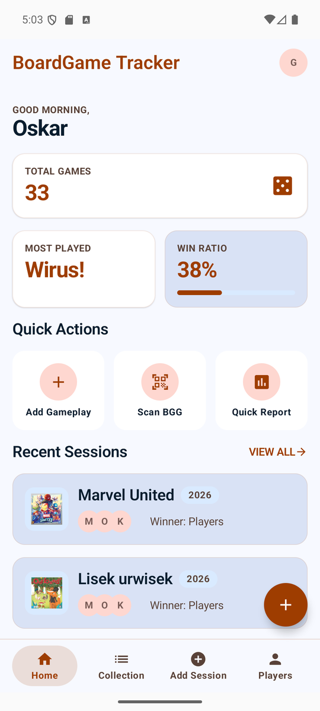 |

**What changed:**
- 🧭 **New navigation** – bottom bar (*Home · Collection · Add Session · Players*) instead of a button menu; a profile avatar in the top bar opens the profile screen.
- 🏠 **Dashboard home screen** – greeting, "Who are you?" picker, total games / most played / win-ratio tiles, quick actions and recent sessions.
- 🎨 **Design system** – new warm Material 3 colour palette, typography, cards, chips and shared components in a dedicated `components` / `theme` package.
- 🌗 **Light and dark theme** across every screen.
- 🖼 **Cover art everywhere** – collection grid, history and recent sessions use game covers.
- 📝 **Redesigned forms** – log session, add game (BGG search / manual entry), add player.
- 🔔 **One feedback mechanism** – themed snackbars instead of toasts (see the notes below).
- ✅ **More tests** – new ViewModel and use-case tests for the redesigned screens (Home, Add Gameplay, Profile and others).

**Still in progress:** the *Quick Report* tile on the home screen is not wired up yet, and the Reports screen has not been redesigned.

 

## 🏠 Home

Dashboard with your stats, quick actions and the three most recent sessions. Choose which player represents you on first launch.  

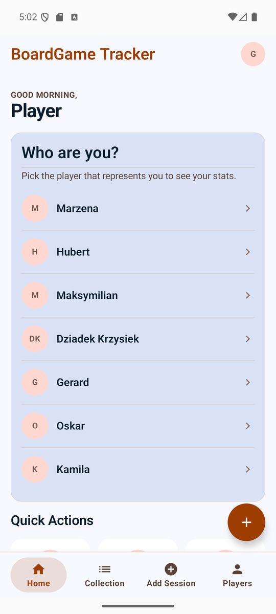

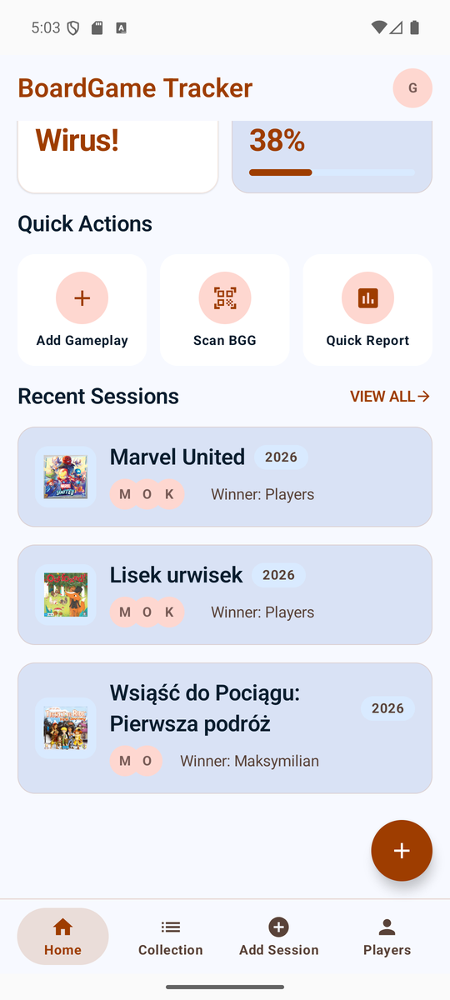
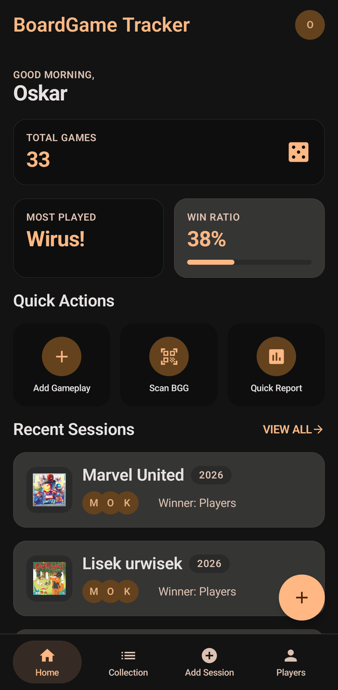

 

## 🎲 Collection

Games shown as a cover grid with a play counter. Filter by *All / Base / Expansions*, search by name and sort (default, name, number of plays). Tap a card to flip it – you get min/max players, total plays and quick actions: **log a session**, **edit** or **delete**.  

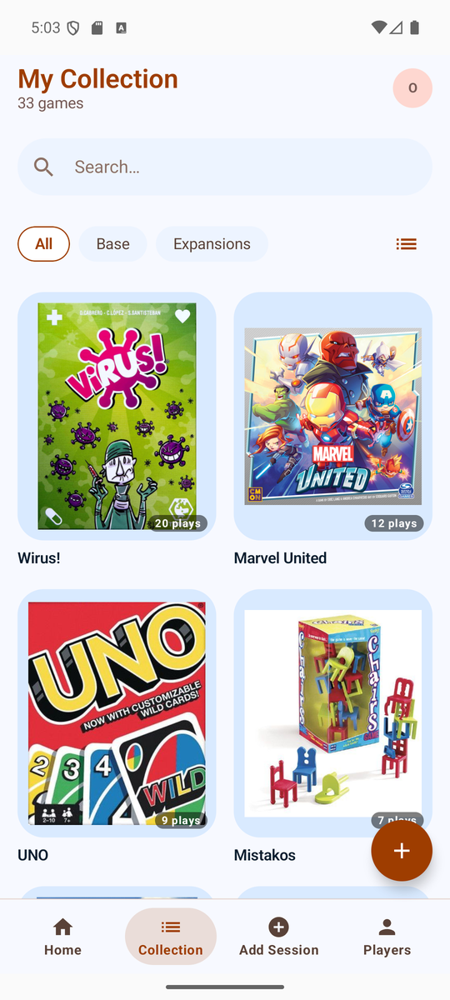
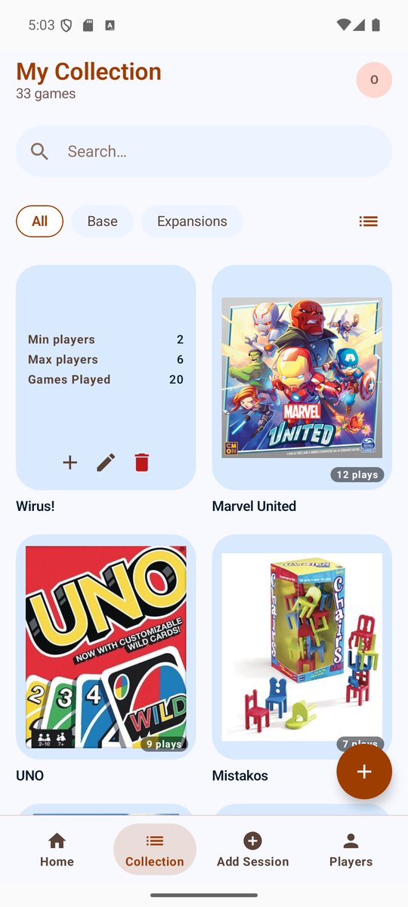
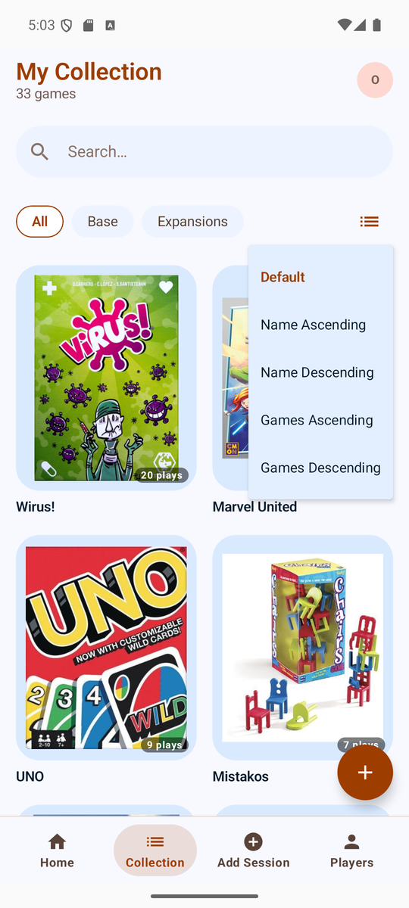
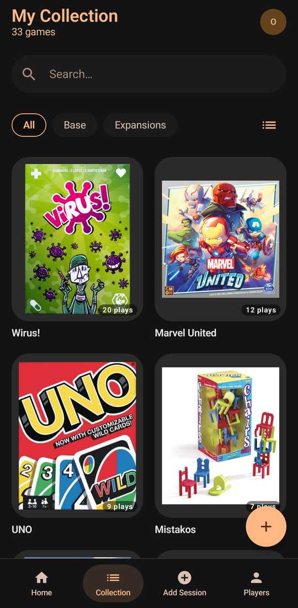

 

## ➕ Add Game

Search the **BGG database** or add a game **manually** (cover from camera/gallery, players range, category, year, co-op switch).
Games imported from BGG have a details screen with rating, weight, play time, categories, mechanics and designers.  

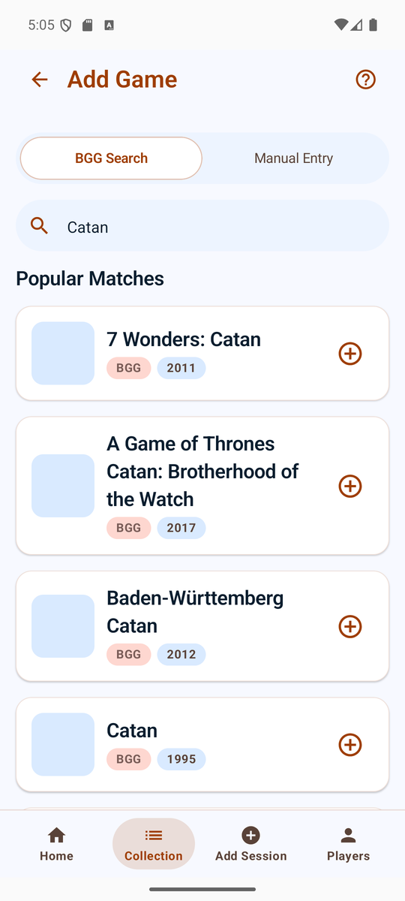
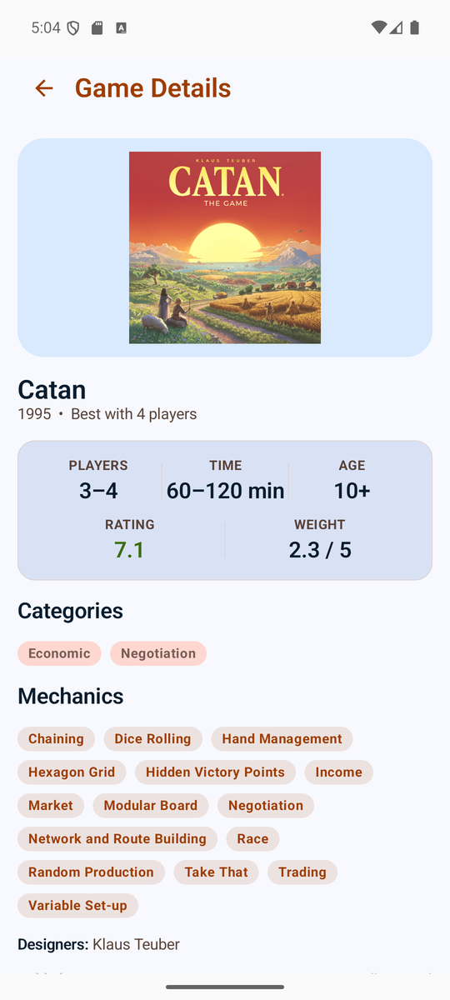
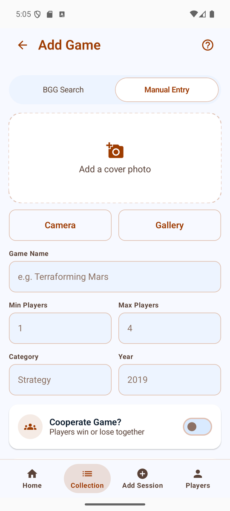

 

## 📝 Log a Gameplay Session

Pick the game, date, duration and participants, choose the winner (or play co-op) and add notes. New players can be added on the fly.  

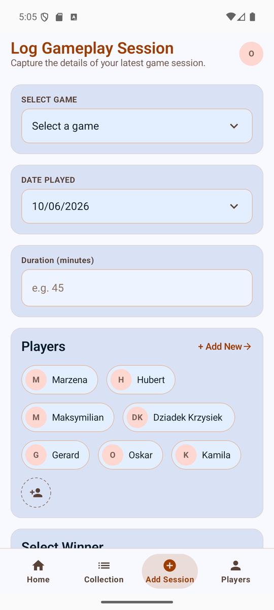
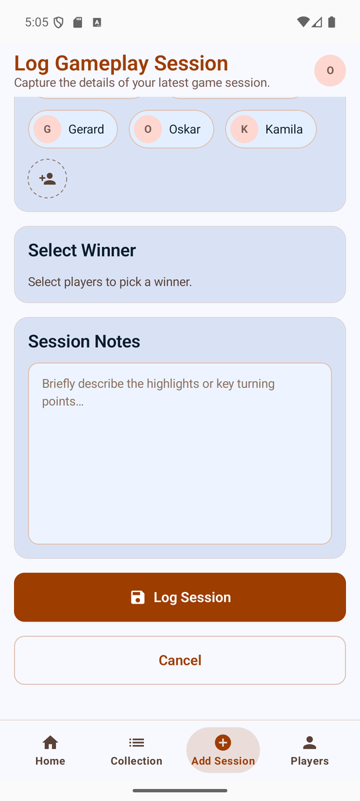
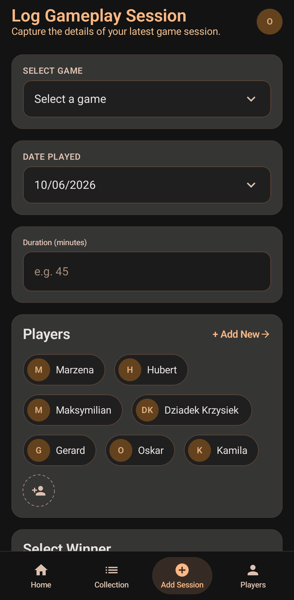

 

## 📜 Gaming History

Sessions grouped into *This week* / *Earlier*, searchable, with covers, participants and winners. Open a session to see the points of each player, notes, and to **edit** or **delete** it.  

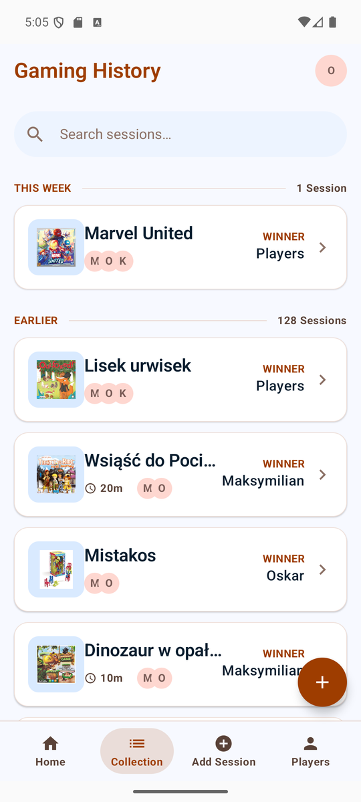
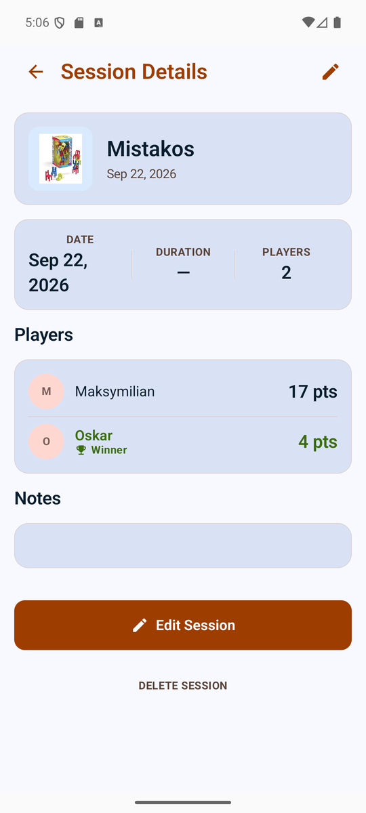

 

## 👤 Players

Players directory with search, win rate and ranking. Each player shows the total number of games played.  

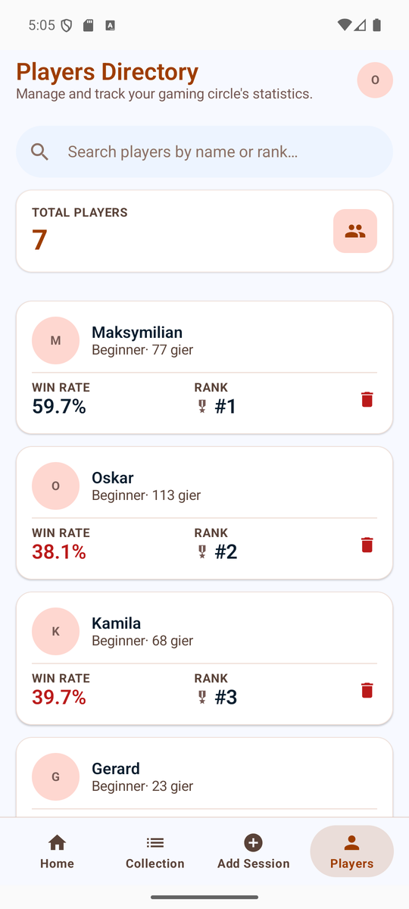
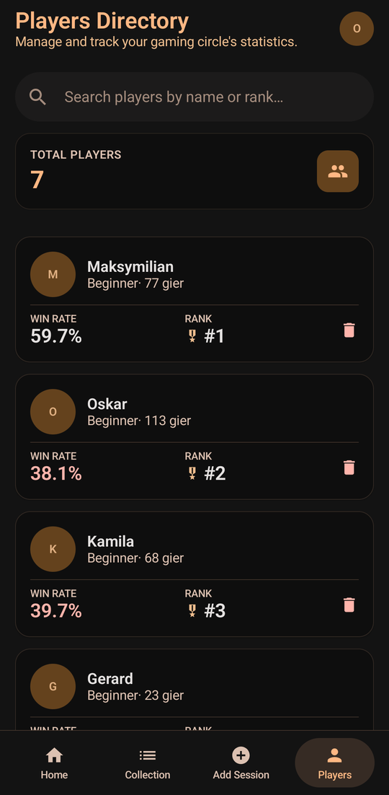

 

## ⚙️ Profile

Your games logged and win rate, account settings and sign-out.  

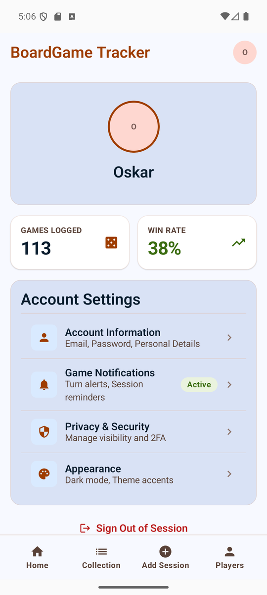

  
## 🏗 Architecture & engineering notes

**Stack:** Kotlin · Jetpack Compose · MVVM · Coroutines + Flow · Voyager (navigation) · Koin (DI) · Room · Retrofit (BGG XML API) · Firebase · Coil · JUnit + MockK + Turbine.

**Structure:** `data` (Room DAOs, Retrofit/BGG, Firebase, repositories that wrap results in a `RequestResult` sealed type) → `ui` (feature-based Compose screens, one `ViewModel` per screen exposing an immutable `State` via `StateFlow`).

**Recent refactor — user feedback & data flow:**
- **One-off events, not boolean state** – success/error are emitted as `Channel` events and shown through a single themed snackbar host (`LocalSnackbarHost`), instead of `success*/errorVisible` flags lingering in UI state.
- **Consistent feedback** – every action (add / edit / delete / login) surfaces a typed snackbar (success / error / info); legacy `Toast`s were removed for a consistent, Compose-native UX.
- **Data before render** – screens load once on entry and show a loader until the data is ready, avoiding flashes of empty/placeholder state.
- **Errors handled at the boundary** – repository calls share a single `safeDbCall` helper (`runCatching` → `RequestResult`), so exceptions don't leak into the UI layer.

**Testing:** unit tests (JUnit + MockK + Turbine) cover ViewModels (state **and** emitted events), repositories/DAOs and use cases; CI runs them on every push (see the badge at the top).

 

   
📄 Licenses

This project's own source code is licensed under the [MIT License](LICENSE).

This project uses several open-source libraries. Key libraries and their licenses include:

[Voyager](https://github.com/adrielcafe/voyager) – MIT License

[Koin](https://insert-koin.io/) – Apache License 2.0

[Retrofit](https://square.github.io/retrofit/) – Apache License 2.0

[Gson](https://github.com/google/gson) – Apache License 2.0

[Coil](https://github.com/coil-kt/coil) – Apache License 2.0

[Timber](https://github.com/JakeWharton/timber) – Apache License 2.0

[Simple XML](http://simple.sourceforge.net/) – Apache License 2.0

[Compose Charts](https://github.com/ehsannarmani/ComposeCharts) – Apache License 2.0

[Sheets Compose Dialogs](https://github.com/maxkeppeler/sheets-compose-dialogs) – MIT License

[Firebase – Google Play Services Terms](https://firebase.google.com/)

You can find full license texts in the third_party_licenses.txt file.
